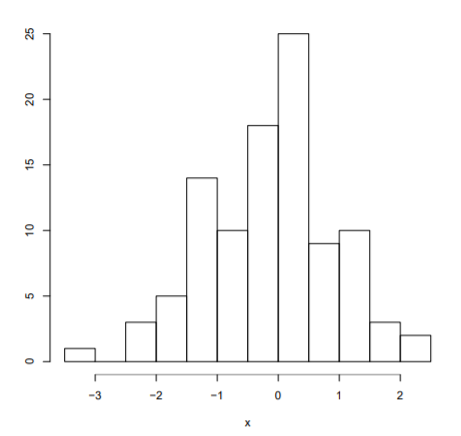
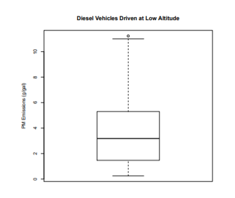
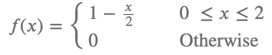
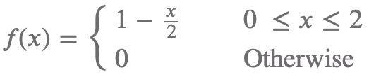

# Stats 201 - Exam 1 Review

1.  Suppose that a researcher is interested in a product manufacturing process. The process is not perfect, and it is expected that there will be defects. She conducts a study and finds that in 100 items, there are 10 items to be defectives. Which one of the following describes the sample in this case?

    1. The sample is all items manufactured in this process.
    1. The sample is the group of 100 items the researcher has studied.
    1. The sample is the 10 items that are defective.
    1. The sample is the study that the researcher has conducted.

2.  Suppose that a researcher is interested in a product manufacturing process. The process is not perfect, and it is expected that there will be defects. She conducts a study and finds that in 100 items, there are 10 items to be defectives. Which one of the following most reasonably describes the population in this case?

    1. The sample is all items manufactured in this process.
    1. The sample is the group of 100 items the researcher has studied.
    1. The sample is the 10 items that are defective.
    1. The sample is the study that the researcher has conducted.

3.  TRUE or FALSE: Population is the entire collection of objects or outcomes about which information is sought.

    1. True
    1. False

4.  TRUE or FALSE: A sample chosen such that each collection of size n is equally likely to make up the sample is called a simple random sample.

    1. True
    1. False

5.  TRUE or FALSE: Two random samples from the same population will always be the same as each other.

    1. True
    1. False

6.  Suppose there are 400 students enrolled in a class and exactly 20% of them are chemical engineering majors. A professor collects a simple random sample of 40 students out of this population. TRUE or FALSE: Exactly 8 of the sample will be chemical engineering majors.

    1. True
    1. False

7.  A researcher is studying the effect of exercise on risk of having a stroke in men over 40. The researcher finds 200 men over age 40 who identify themselves as exercising regularly. She matches each with a similar man who does not exercise regularly. She studies both groups for 5 years.

    If the researcher finds a difference in the rate of stroke occurrence between the two groups can she conclude that exercise is the cause of the difference?

    1. Yes, because this is a controlled experiment
    1. Yes, because this is an observational study
    1. No, because this is a controlled experiment
    1. No, because this is an observational study

8.  TRUE or FALSE: Causation conclusions are justified in observational studies.

    1.  A. True
    1.  False

9.  A manufacturer of batteries is testing the lifetime of a certain type of battery. A sample of such batteries is collected and hours of their lifetimes are given as follows:

    102, 105, 107, 110, 108, 106, 101, 103, 104, 109

    What is the mean lifetime in hours?

    1. 101
    1. 102.5
    1. 105.5
    1. 107.5
    1. 110
    1. 105

10. A manufacturer of batteries is testing the lifetime of a certain type of battery. A sample of such batteries is collected and hours of their lifetimes are given as follows:

    102, 105, 107, 110, 108, 106, 101, 103, 104,109

    What is the first quartile of the lifetime of sampled batteries in hours?

    1. 101
    1. 102.5
    1. 105.5
    1. 107.5
    1. 110
    1. 105

11. What does the sample mean measure?

    1. Shape
    1. Spread
    1. Skewness
    1. Center
    1. Outliers

12. Given a sample with sample variance 56.25, the sample standard deviation is

    1. 3164.0625
    1. 56.25
    1. 7.5
    1. -7.5
    1. -56.25
    1. -3164.0625

13. What does the sample variance measure?

    1. Shape
    1. Spread
    1. Skewness
    1. Center
    1. Outliers

14. The following histogram represents data for a sample of size 100. What is the approximate median for this data?

    

    1. -1
    1. -0.75
    1. -0.5
    1. 0.75
    1. 1

15. The following picture shows a boxplot for PM emissions of diesel vehicles driven at low altitude.

    

    The value of 3 PM is closest to the:

    1. Q1
    1. Q3
    1. Median
    1. Mean
    1. Standard Deviation
    1. Outlier

16. The following picture shows a boxplot for PM emissions of diesel vehicles driven at low altitude.

    

    TRUE or FALSE: For this data, the sample mean will be larger than the sample median

    1. True
    1. False
    1. Impossible to determine

17. TRUE or FALSE: A numerical summary of the sample is called a statistic.

    1.  A. True
    1.  False

18. TRUE or FALSE: A numerical summary of the population is called a parameter.

    1.  A. True
    1.  False

19. TRUE of FALSE: Statistics are often used to estimate unknown parameters.

    1.  A. True
    1.  False

20. TRUE or FALSE: 1.5IQR rule defines outliers, for a sample, as the values that lie outside the range from median-1.5IQR to median+1.5IQR.

    1. True
    1. False

21. TRUE or FALSE: In a box plot, the box is defined by the first and third quartiles of the sample.

    1. True
    1. False

22. For an even A, the likelihood that A occurs is measured by P(A). TRUE or FALSE: 0 ≤ 𝑃(𝐴) ≤ 1.

    1. True
    1. False

23. A manufacturer receives certain components in large lots. The number of defectives in each lot is a discrete random variable (denoted by X) and has the following probability mass function.

    X 0 1 2 3
    p(x) 0.5 0.2 0.2 0.1

    What is the probability of observing at least one defective?

    1. 0.1
    1. 0.2
    1. 0.3
    1. 0.5
    1. None of the above

24. A manufacturer receives certain components in large lots. The number of defectives in each lot is a discrete random variable (denoted by X) and has the following probability mass function.

    X 0 1 2 3
    p(x) 0.5 0.2 0.2 0.1

    What is the mean number of defectives for this random variable?

    1. 0.0
    1. 0.9
    1. 1.2
    1. 2.3
    1. None of the above

25. A system contains two components, A and 1. The system will only function if both A and B function. The probability that A functions is 0.98, the probability that B functions is 0.95, and the probability that either A or B functions is 0.99. What is the probability that the system functions?

    1. 0.931
    1. 0.94
    1. 0.95
    1. 0.98
    1. 0.99

26. A seed packaging company purchases 40% of their beans seeds from supplier A and 60% from supplier B and mixes these seeds together. If the bean seed comes from supplier A, the probability it will germinate is 85%. If the bean seed comes from supplier B, the probability it will germinate is 75%.

    Given that a seed germinates, find the probability that the seed was purchased from supplier A.

    1. 0.3
    1. 0.43
    1. 0.79
    1. 0.85
    1. none of the above

27. A seed packaging company purchases 40% of their beans seeds from supplier A and 60% from supplier B and mixes these seeds together. If the bean seed comes from supplier A, the probability it will germinate is 85%. If the bean seed comes from supplier B, the probability it will germinate is 75%.

    What is the probability that a seed germinates?

    1. 0.34
    1. 0.43
    1. 0.79
    1. 0.85
    1. none of the above
    1. impossible to determine without more information

28. A town has two fire engines, A and B, that operate independently. The probability that engine A is available when needed is 0.96. The probability that engine B is available when needed is also 0.96.

    What is the probability that neither fire engine is available when needed?

    1. 0.0016
    1. 0.0400
    1. 0.9216
    1. 0.9600
    1. 0.9984
    1. None of the above

29. A town has two fire engines, A and B, that operate independently. The probability that engine A is available when needed is 0.96. The probability that engine B is available when needed is also 0.96.

    What is the probability that a fire engine is available when needed?

    1. 0.0016
    1. 0.0400
    1. 0.9216
    1. 0.9600
    1. 0.9984
    1. None of the above

30. A vendor begins using heavier packaging, which increases the weight of each package she sends out by 50 g. How does this change affect the mean and standard deviation?

    1. Both the mean and the standard deviation remain unchanged
    1. The mean remains unchanged but the standard deviation increases
    1. The mean increases but the standard deviation remains unchanged
    1. Both the mean and the standard deviation increase
    1. None of the above

31. Let A and B be events with P(A) = 0.8 and P(A ∩ B) = 0.2. For what value of P(B) will A and B be independent?

    1. 0.2
    1. 0.25
    1. 0.6
    1. None of the above
    1. Impossible to determine from the information

32. TRUE or FALSE: If A and B are mutually exclusive then P(A ∩ B) = P(A)P(B).

    1. True
    1. False

33. TRUE or FALSE: P(A ∩ B) = P(A|B)P(B).

    1. True
    1. False

34. If X ∼ Bin(8, 0.3), what is the variance of X?

    1. 1.68
    1. 2.4
    1. 8.0
    1. 1.30
    1. 0.30
    1. Impossible to determine

35. If X ∼ N(12, 9), what is the variance of X?

    1. 12
    1. 9
    1. 3
    1. 108
    1. Impossible to determine

36. Let X = the number of text messages received in a 30 minute perio1. Assume that the average number of messages is the same for any given 30 minute perio1. What is the best distribution for modelling X?

    1. Bernoulli
    1. Binomial
    1. Poisson
    1. Normal

37. Consider the sampling distribution of X̄ based on a sample of size 10 from an extremely right skewed population with mean µ = 2.8 and variance σ2 = 1.

    The mean of the sampling distribution of X̄ will be

    1. Smaller than 2.8
    1. Exactly equal to 2.8
    1. Larger than 2.8
    1. Can not be determined

38. Consider the sampling distribution of X̄ based on a sample of size 10 from an extremely right skewed population with mean µ = 2.8 and variance σ2 = 1.

    The variance of the sampling distribution of X̄ will be

    1. Smaller than 1
    1. Exactly equal to 1
    1. Larger than 1
    1. Can not be determined

39. Consider the sampling distribution of X̄ based on a sample of size 10 from an extremely right skewed population with mean µ = 2.8 and variance σ2 = 1.

    What is the shape of the theoretical sampling distribution of X̄?

    1. Approximately Normal
    1. Approximately Uniform
    1. Approximately Poisson
    1. Cannot be determined

40. Consider the sampling distribution of X̄ based on a sample of size 10 from an extremely right skewed population with mean µ = 2.8 and variance σ2 = 1.

    Consider now the sampling distribution of X̄ based on a sample of size 100 from the same population. What is the shape of the theoretical sampling distribution of X̄?

    1. Approximately Normal
    1. Approximately Uniform
    1. Approximately Poisson
    1. Cannot be determined

41. The length of a machine part is known to have a normal distribution with a mean of 100 mm and a standard deviation of 2 mm. What is the z-score for a part that is 103.3 mm long?

    1. 3.3
    1. 1.65
    1. 0.9506
    1. 0.825
    1. 0.0494
    1. None of the above

42. The travel time between two campuses of a university in a city via shuttle follows a right-skewed distribution with a mean of µ = 28 minutes and a standard deviation σ = 5 minutes. In the course of a randomly selected week, n = 78 shuttle trips are made.

    What is the z-score for one randomly selected shuttle trip that is 30 minutes long?

    1. 0.2
    1. 0.4
    1. 2.0
    1. 3.5
    1. It is not appropriate to compute the z-score since the distribution of shuttle trips is not normally distributed

43. The travel time between two campuses of a university in a city via shuttle follows a right-skewed distribution with a mean of µ = 28 minutes and a standard deviation σ = 5 minutes. In the course of a randomly selected week, n = 78 shuttle trips are made.

    What is the z-score of the mean of the 78 shuttle trips if the mean is 30 minutes?

    1. 0.2
    1. 0.4
    1. 2.0
    1. 3.5
    1. It is not appropriate to compute the z-score since the distribution of the means of n = 78 shuttle trips is not normally distributed

44. A continuous random variable, X, has density function:

    

    What is the mean of X?

    1. 2/3
    1. 1/2
    1. 1
    1. 4/3

45. A continuous random variable, X, has density function:

    

    What is the probability that X is less than 1?

    1. 5/12
    1. 1/2
    1. 1/6
    1. 3/4
